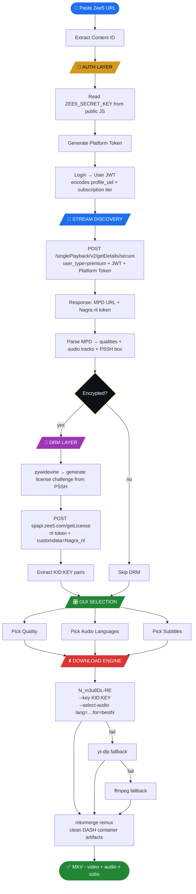
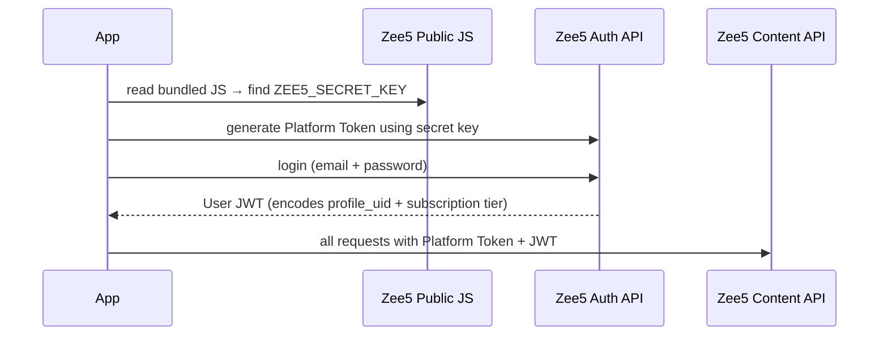
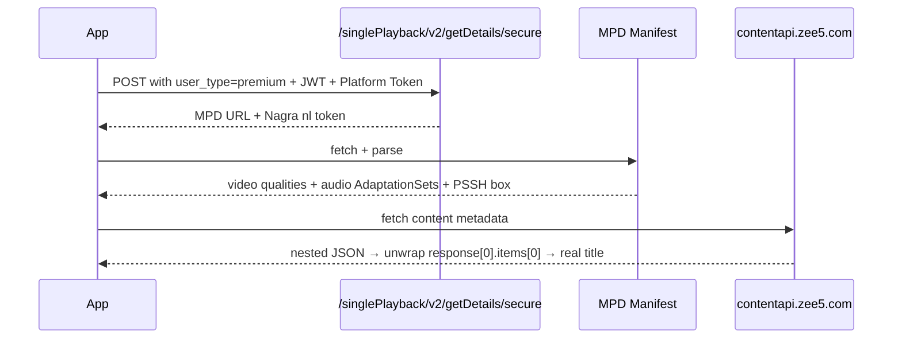
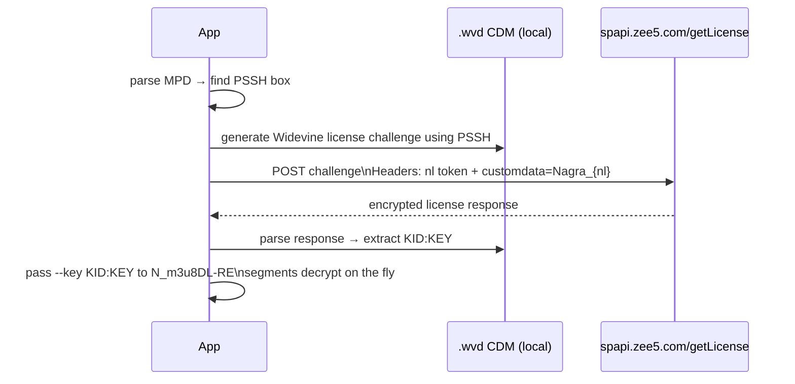
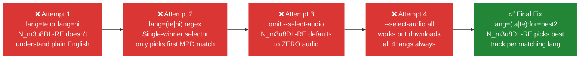
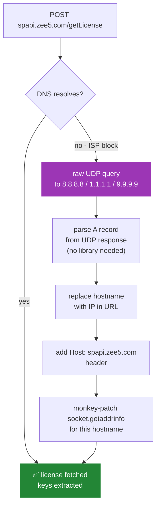

# Zee5 Downloader

<p align="center">
  <a href="https://github.com/arvind88765/zee5_downloader/stargazers">
    
  </a>
  <a href="https://github.com/arvind88765/zee5_downloader/network/members">
    
  </a>
  
  
  
</p>

<p align="center">
  <b>if this saved you time drop a star, takes 1 second</b>
</p>

---

GUI app to download Zee5 content with full Widevine L3 DRM support, multi-audio track selection, subtitles, and live progress tracking - built entirely by reverse engineering Zee5's private APIs from scratch.

> **⚠️ Disclaimer:** This project is built purely for **educational and research purposes** - to study API structures, DRM flows, and streaming protocols. It demonstrates how reverse engineering works on a real-world platform.
> Do **not** use this to pirate or redistribute content. Downloaded content is for **personal, private viewing only**.
> The authors hold no responsibility for misuse. Use at your own risk and in compliance with your local laws and Zee5's Terms of Service.

---

## Demo

<!-- paste your demo video link here -->

https://github.com/user-attachments/assets/30eb9c68-be07-41ec-8e54-58444397f9b8

---

## Features

| | Feature | Details |
|---|---|---|
| 🔐 | **Widevine L3 DRM** | Auto PSSH extraction + key decryption via your `.wvd` CDM |
| 🎵 | **Multi-audio** | Pick exactly which languages you want - `lang=(ta|te):for=best2` |
| 📺 | **Quality picker** | 240p / 360p / 480p / 576p with size + runtime estimates |
| 📝 | **Subtitles** | Auto-detected, muxed into final MKV |
| ⚡ | **Parallel downloads** | All selected qualities download at the same time |
| 📊 | **Live progress** | `Downloading 45%` → `Decrypting` → `Merging` → `✓ Done` |
| 🎬 | **mkvmerge remux** | Cleans DASH container artifacts for smooth playback |
| 🏷️ | **Smart filenames** | Pulled from Zee5 content API, not URL guessing |
| 🌐 | **DNS bypass** | Auto-routes around ISP DNS blocks on the license server |

---

## Full System Flow



---

## The Story - How We Built This

> this wasn't just "call an API and download". Zee5 has multiple auth layers, a non-obvious streaming flow, and real quirks that took digging to figure out. here's everything we reverse engineered.

---

### 1 · Cracking the Auth Flow

Zee5 uses **two separate token layers** that both need to be present on every API call:



- **Platform Token** - Zee5 bakes `ZEE5_SECRET_KEY` (`gBQaZLiNdGN9UsCKZaloghz9t9StWLSD`) into their public JS bundle. we found it by reading their minified code. this key generates the platform token every API call needs.
- **User JWT** - after login, Zee5 returns a JWT encoding the user's `profile_uid` and subscription tier (`free` / `premium`). the playback API uses this to decide what stream quality to serve.

Both are handled automatically - login once, token saves locally, platform token refreshes on every launch.

---

### 2 · Reverse Engineering the Playback API

The stream URL isn't in the page source. You have to know the exact endpoint and headers:



Key discoveries:
- endpoint behaves differently for `user_type=premium` vs `free`
- returns a **Nagra `nl` token** alongside the MPD - this token is required for the license request
- content API returns **deeply nested JSON**, not flat - had to unwrap `response[0].items[0]` to get the real title
- Zee5 MPD uses **2-letter ISO 639-1** lang codes (`te`, `ta`, `kn`) not 3-letter (`tel`, `tam`, `kan`) - broke our filename builder until we added the full mapping table

---

### 3 · Widevine DRM - Key Extraction



The Nagra `nl` token format was the tricky part - it had to be in `customdata=Nagra_{nl}` in the POST body, not just as a header.

---

### 4 · The Multi-Audio Nightmare (biggest problem we hit)

This took **4 attempts** across multiple sessions to get right:



The `:for=bestN` qualifier was buried in N_m3u8DL-RE's selector syntax - `lang=(ta|te):for=best2` tells it to pick the best track for each matching language. Found it by reading another downloader's source code.

```bash
# the correct selector patterns
--select-audio lang=ta:for=best          # exactly 1 lang
--select-audio lang=(ta|te):for=best2    # exactly 2 langs
--select-audio lang=(ta|te|ml):for=best3 # exactly 3 langs
--select-audio all                        # everything
```

---

### 5 · ISP DNS Blocking - 401 on License Server

Some ISPs block `spapi.zee5.com` at DNS level. The license POST fails with `getaddrinfo failed` which surfaces as a 401 - very confusing to debug.



This runs silently - if the first attempt hits a DNS error, it auto-retries via IP. No user action needed.

---

### 6 · Other Bugs We Fixed

| Bug | Root Cause | Fix |
|---|---|---|
| Parallel downloads crash | Two N_m3u8DL-RE processes created log files with the same millisecond timestamp → collision | Pass `--no-log` - we capture everything via stdout anyway |
| Filename shows "Embed" or "Watch" | URL parser treating path segments like `embed`, `details`, `watch` as show names | Built `_SKIP` set + proper scheme/host stripping |
| Audio tracks show as "unknown" | Filename builder had ISO 639-2 codes (`tel`, `tam`), Zee5 MPD uses ISO 639-1 (`te`, `ta`) | Added full 2-letter → name mapping table |
| Progress stuck at "Starting..." | `phase_cb` was a no-op - never updated the label | Wired phase signals: `downloading` → `decrypting` → `muxing` |

---

## What You Need

| Thing | Required? | Notes |
|---|---|---|
| Python 3.9+ | ✅ yes | |
| N_m3u8DL-RE | ✅ yes | `:for=bestN` multi-audio only works here |
| mkvmerge | ✅ yes | MKVToolNix - clean container remux |
| ffmpeg | ✅ yes | fallback engine |
| `.wvd` device file | ✅ for DRM | Widevine L3 software CDM |
| pywidevine | ✅ for DRM | `pip install pywidevine` |
| yt-dlp | optional | auto fallback, installs itself |

---

## Setup

### 1 · Clone + Install
```bash
git clone https://github.com/arvind88765/zee5_downloader.git
cd zee5_downloader
pip install -r requirements.txt
```

### 2 · External Binaries

- **N_m3u8DL-RE** → [releases](https://github.com/nilaoda/N_m3u8DL-RE/releases) - grab `N_m3u8DL-RE_Beta_win-x64.zip`
- **mkvmerge** → install [MKVToolNix](https://mkvtoolnix.download/downloads.html)
- **ffmpeg** → [gyan.dev/ffmpeg/builds](https://www.gyan.dev/ffmpeg/builds/) - grab `ffmpeg-release-full.7z`

Add to PATH or paste full paths in Settings.

### 3 · WVD Device File

**What is a `.wvd` file?**

A `.wvd` (Widevine Device) file is a software CDM (Content Decryption Module) - basically a virtual Widevine L3 device that lives on your PC. Zee5 uses Widevine DRM to encrypt their streams. To decrypt them, you need to prove to the license server that you have a valid Widevine device. The `.wvd` file is that proof.

Without it: the app downloads encrypted segments, mkvmerge stitches them together, and the output file plays garbled or not at all. Completely useless.

With it: the app sends a license challenge to `spapi.zee5.com`, gets back the decryption keys, and N_m3u8DL-RE decrypts every segment on the fly. Clean playback.

**How to get one:**

There is no official way to distribute `.wvd` files - you extract one from an Android device or emulator yourself. The standard tool for this is:

- [**devine**](https://github.com/devine-dl/devine) - open source Widevine CDM toolkit, has a guide on extracting L3 from an Android emulator
- [**pywidevine docs**](https://github.com/devine-dl/pywidevine) - the library this app uses, explains the `.wvd` format

Short version: spin up an Android emulator, install a streaming app, run a CDM extraction script against it, export the `.wvd`. Full step-by-step guide here:

- [**Dumping Your Own L3 CDM with Android Studio**](https://forum.videohelp.com/threads/408031-Dumping-Your-own-L3-CDM-with-Android-Studio) - VideoHelp forums, most complete guide out there

Once you have it: open Settings in the app, paste the path to your `.wvd` file, save. Keys are fetched fresh every download and nothing is stored.

### 4 · Run
```bash
python zee5_downloader.py
```

Login → paste URL → Fetch Qualities → pick what you want → Download.

---

## Filenames

```
Hi Tamil + Telugu TRUE WEB-DL - 1080p - AVC - (AAC - 139Kbps) - 2.1 GB.mkv
Hi Hindi TRUE WEB-DL - 480p - AVC - (AAC - 139Kbps) - 640 MB.mkv
```

Title comes from the Zee5 content API. Falls back to URL parsing if API returns nothing.

---

## Speed

| Engine | Speed on 90 Mbps | Multi-audio | DRM |
|---|---|---|---|
| N_m3u8DL-RE | ~20 sec / 2hr movie | ✅ yes | ✅ inline |
| yt-dlp | ~1 min / 2hr movie | limited | ❌ no |
| ffmpeg | 5+ min / 2hr movie | ❌ no | ❌ no |

---

## Troubleshooting

| Problem | Fix |
|---|---|
| Only video, no audio | N_m3u8DL-RE path wrong in Settings |
| All 4 langs download when you picked 2 | Update to latest - `:for=bestN` fix |
| DRM content plays garbled | WVD file revoked or path wrong |
| `getaddrinfo failed` / 401 on license | DNS blocked - app auto-retries via UDP bypass |
| Filename says "Embed" or "Details" | Old version - URL parser is fixed now |
| Parallel downloads crash | Old version - `--no-log` fix is in |

---

## Files

```
zee5_downloader.py    <- run this
requirements.txt      <- pip install -r this
```

Config and token auto-saved on first run, gitignored so they never get committed.

### Why everything is in one file

Intentional. When you split into `auth.py`, `drm.py`, `gui.py`, `utils.py` etc., someone cloning this at 2am has to figure out which file to run, how the imports connect, why something broke. That kills adoption.

One file means: clone, `python zee5_downloader.py`, done. No folder hunting, no module confusion, no entry point mystery. The whole tool is readable with a single ctrl+F.

3000 lines is still manageable. Splitting only makes sense past 10k+ when it becomes genuinely unmaintainable. For a tool like this, single file is the right call.

---

made by **Rvind** 
